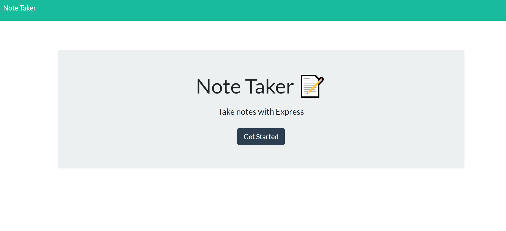

# express-note-taker
Note taking application designed to write, save and delete notes, written to a backend JSON

## Description

This is an application that can be used to write, save, and delete notes. This application uses an express backend and saves and retrieves note data from a JSON file.

* The application frontend has already been created, my job is to build the backend and connect the two.

* The following HTML routes should be created:

  * GET `/notes` - Should return the `notes.html` file.

  * GET `*` - Should return the `index.html` file

* The application should have a `db.json` file on the backend that will be used to store and retrieve notes using the `fs` module.

* The following API routes should be created:

  * GET `/api/notes` - Should read the `db.json` file and return all saved notes as JSON.

  * POST `/api/notes` - Should receive a new note to save on the request body, add it to the `db.json` file, and then return the new note to the client.

  * DELETE `/api/notes/:id` - Should receive a query parameter containing the id of a note to delete. This means I need to find a way to give each note a unique `id` when it's saved. In order to delete a note, I need to read all notes from the `db.json` file, remove the note with the given `id` property, and then rewrite the notes to the `db.json` file.
  
  ## Deployment
  
  https://ancient-mesa-52679.herokuapp.com/
